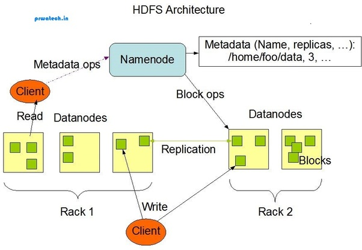
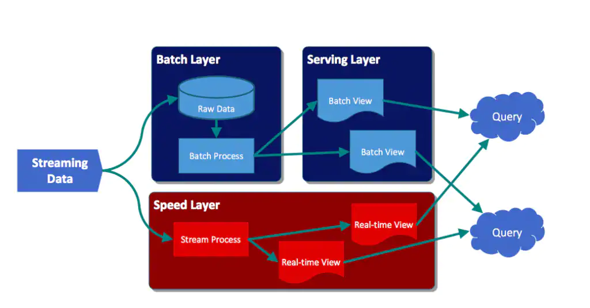
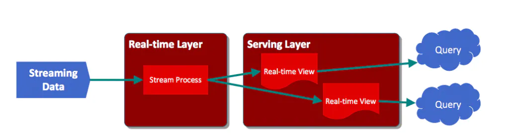
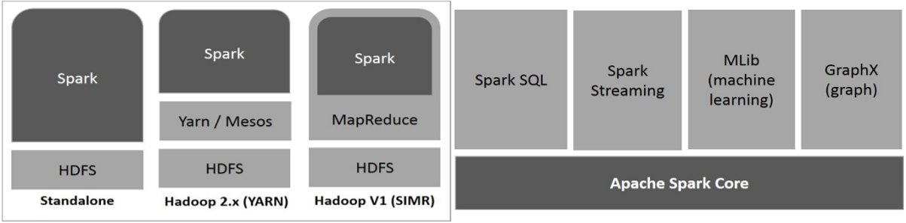
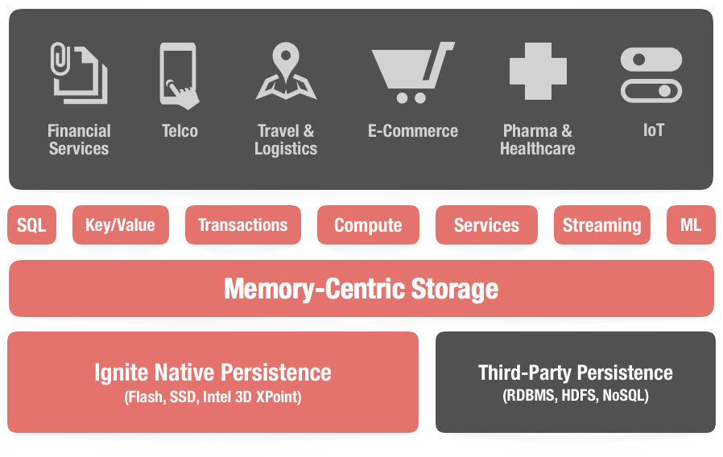
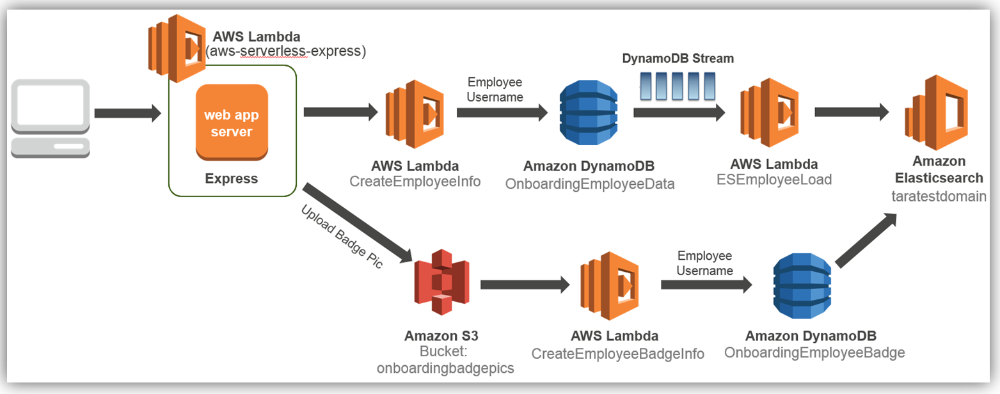
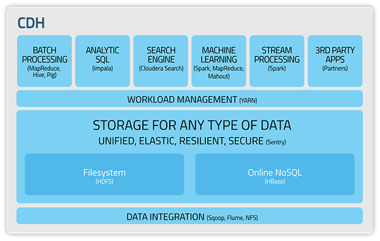

# BigData Study Project

**BigData Pipeline**

- [Data 수집] ▶ [Data 직렬화] ▶ [Data 저장] ▶ [Data 처리] ▶ [Data 분석] ▶ [Data 시각화] ▶ [Data 관리]

[BigData Pipeline]


## [Data 수집]
- Logstash, Beats (Packet/Top/File beats)
- **Apache Flume**, Yahoo Chuckwa, Facebook Scribe, Apache Sqoop

### ☞ Apache Kafka [](https://kafka.apache.org/documentation/)&nbsp;[](https://kafka.apache.org/quickstart)&nbsp;

[Kafka Architecture] [](https://kafka.apache.org/intro)


```js
- Producer API : 한 개 이상의 topic에 stream을 publish할 수 있는 응용 프로그램을 제작
- Consumer API : 한 개 이상의 topic을 subscribe하고 생성된 record stream을 처리
- Streams  API : 한 개 이상의 topic에서 메시지의 직렬화/역직렬화를 처리하고 상태 저장 작업에 필요한 상태를 유지, Kafka Cluster와 통신하는 Java Client Library (현재 Scala)
- Connector API: kafka에 기록된 data를 기존 응용 프로그램 또는 DB에 연결하는 재사용 가능한 Producer 또는 Consumer를 구축 및 실행
```

- Apachae Camus : 카프카에서 hdfs로 데이터를 배치로 옮겨주는 역할

### ★Run (On Windows)

- Download : http://mirror.navercorp.com/apache/kafka/2.3.1/

- Run Zookeeper/Kafka & Create Topic & Run Consumer/Producer

```java
# Zookeeper Run
> bin/windows/zookeeper-server-start.bat config/zookeeper.properties

# Kafka Run
> bin/windows/kafka-server-start.bat config/server.properties

# Topic 생성
> bin/windows/kafka-topics.bat --create --zookeeper localhost:2181 --replication-factor 1 --partitions 1 --topic kafka-test-topic

# Topic List 확인
> bin/windows/kafka-topics.bat --list --zookeeper localhost:2181

# Topic 삭제 : /temp/zookeeper & kafka-logs로 관리
> bin/windows/kafka-topics.bat --delete --zookeeper localhost --topic kafka-test-topic

# Consumer Run -> Get Message
> bin/windows/kafka-console-consumer.bat --bootstrap-server localhost:9092 --topic kafka-test-topic

# Producer Run -> Send Message
> bin/windows/kafka-console-producer.bat --broker-list localhost:9092 --topic kafka-test-topic
> test message#1
> test message#2
> test message#3
```

- Run API : http://localhost:8080/get?message=kafka-test-message

```java
# Run Zookeeper & Kafka
# Create Topic
# JUnit Test KafkaExampleApplicationTests
```

#### <설계/고려사항>
- Kafka는 실제로 대규모 Stream을 처리하도록 설계되어 규모가 없거나 예상하지 못한 경우, 설정하고 유지/관리하는 것은 가치가 없음.

```js
- 장애 발생 시 데이터 처리 보장
- 누락 데이터 확인을 위한 메타정보 추가
- 데이터 복구 방안
```

---

## [Data 직렬화]

#### ■ Apache Parquet [](https://parquet.apache.org/)&nbsp;

- Apache Parquet는 데이터 처리 프레임 워크, 데이터 모델 또는 프로그래밍 언어의 선택에 관계없이 Hadoop 에코 시스템의 모든 프로젝트에서 사용할 수 있는 컬럼 스토리지 형식

```js
- Hadoop HDFS에서 주로 사용하는 파일 포맷
- 중첩된 데이터를 효율적으로 저장할 수 있는 컬럼 기준 저장 포맷 <- 압축률이 더 좋다.
- 컬럼 기준 포맷은 파일 크기와 쿼리 성능 측면에 모두 효율성이 높음 <- I/O 사용률이 줄어든다.
- 자바 구현체는 단일 표현에 얽매이지 않기 때문에 Parquet 파일에서 데이터를 읽고 쓰는데 Avro, Thrift, Protocol Buffer의 In-memory 데이터 모델을 사용할 수 있음
```

#### ■ Apache Thrift [](https://thrift.apache.org/)&nbsp;

- 확장 가능한 언어 간 서비스 개발을 위한 Apache Thrift 소프트웨어 프레임 워크는 소프트웨어 스택과 코드 생성 엔진을 결합 (C ++, Java, Python, PHP, Ruby, Erlang, Perl, Haskell, C #, Cocoa, JavaScript, Node.js, Smalltalk, OCaml 및 Delphi 및 기타 언어)

```js
- Facebook에서 개발한 서로 다른 언어로 개발된 모듈들의 통합을 지원하는 RPC Framework
```

### ☞ Google Protocol Buffer [](https://developers.google.com/protocol-buffers)&nbsp;

- 프로토콜 버퍼는 구조화된 데이터를 직렬화하기 위한 Google의 언어, 플랫폼 중립적이며 확장 가능한 메커니즘으로 XML은 작지만 더 빠르고 단순함

```js
- 구글에서 개발 오픈한 Serialized Data Structure
- C++,C#, Go, Java, Python, Object C, Javascript, Ruby 등 다양한 언어를 지원하며, 직렬화 속도가 빠르고 직렬화된 파일의 크기도 작아서 Apache Avro 파일 포맷과 함께 많이 사용됨
- GRPC Network Protocol의 경우 HTTP 2.0 을 기반으로 하여 직렬화
- 하나의 파일에 최대 64M 까지 지원 가능하며, JSON 파일을 프로토콜 버퍼 파일 포맷으로 전환이 가능하고, 반대로 프로토콜 버퍼 파일도 JSON으로 전환이 가능
```

### ☞ Apache Avro [](http://avro.apache.org/docs/current/)&nbsp;

- Avro는 언어 독립적인 직렬화 라이브러리로 핵심 구성 요소 중 하나인 스키마를 사용. 추가 데이터 처리를 위해 스키마를 JSON 파일에 저장함

```js
- 특정 언어에 종속되지 않은 언어 중립적 데이터 직렬화 시스템
- 하둡 Writable(직렬화 방식)의 주요 단점인 언어 이식성(language portablility)을 해결하기 위해 만든 프로젝트
- 스키마는 JSON으로 작성
- 데이터는 작고 빠른 바이너리 포맷으로 직렬화
```

### ★Run [](https://avro.apache.org/docs/current/gettingstartedjava.html#Defining+a+schema)
- Apache Avro를 사용하여 AvroHttRequest Class를 직렬화 및 역직렬화 수행 example code
- Apache Kafka에는 다수의 built in (de)serializers가 제공되지만 Avro는 포함되어 있지 않음

[Add dependency]

```xml
<dependency>
    <groupId>org.apache.avro</groupId>
    <artifactId>avro-compiler</artifactId>
    <version>1.8.2</version>
</dependency>
<dependency>
    <groupId>org.apache.avro</groupId>
    <artifactId>avro-maven-plugin</artifactId>
    <version>1.8.2</version>
</dependency>
```

[Defining a schema (user.avsc)]

```json
{
 "namespace": "mincloud.example.avro",
 "type": "record",
 "name": "User",
 "fields": [
     {"name": "name", "type": "string"},
     {"name": "favorite_number",  "type": ["int", "null"]},
     {"name": "favorite_color", "type": ["string", "null"]}
 ]
}
```

[Compiling the schema]

```
> java -jar avro-tools-1.9.1.jar compile schema user.avsc .
```

[Serializing / Deserializing Test]

- Zookeeper 실행 후 embeddedKafka 연동하여 Test

```java
@ClassRule
public static EmbeddedKafkaRule embeddedKafka = new EmbeddedKafkaRule(1, true, RECEIVER_TOPIC);

@Before
public void setUp() throws Exception {
    for (MessageListenerContainer messageListenerContainer : kafkaListenerEndpointRegistry.getListenerContainers()) {
    	ContainerTestUtils.waitForAssignment(messageListenerContainer, embeddedKafka.getEmbeddedKafka().getPartitionsPerTopic());
    }
}
```

---

## [Data 저장]

#### ■ Apache Hadoop HDFS(Hadoop Distributed File System) [](https://hadoop.apache.org/docs/stable/hadoop-project-dist/hadoop-common/SingleCluster.html)

[구성요소]

```js
- 여러 데이터 서버에 데이터를 저장하는 Hadoop의 스토리지 계층으로 Namenode와 Datanode로 구성
- NameNode : Namenode는 마스터 서버, Namenode는 다양한 데이터 노드,위치,각 블록의 크기 등에 대한 Metadata 정보를 저장
- DataNode : Block report를 10초마다 Namenode에 전송하는 multi-instance server. N개의 Datanode server가 있을 수 있으며, Namenode에 의해 요청될 때 블록을 저장하고 검색하며, 클라이언트의 요청을 read/write하며 Namenode의 지시에 따라 블록 생성/삭제 및 복제를 수행
```

[HDFS Architecture]



[동작 원리]

```js
- HDFS는 데이터를 수집할 때 정보를 개별 블록으로 나누어 클러스터의 다른 노드에 분산시켜 작업을 병렬로 수행하여 보다 효율적으로 작업할 수 있도록 함
- 무장애 기능이 뛰어나도록 특별히 설계되어, 파일 시스템은 각 데이터 조각을 여러번 복제하거나 복사하고(복제 팩터라고 함) 개별 노드에 배포하여 다른 노드와 다른 서버 랙에 하나 이상의 복사본을 배치
```

#### ■ Apache HBASE (HDFS 컬럼 기반 DB)

```js
- 뛰어난 Horizontal Scalability를 가지는 Distributed DB, Column-oriented store model
- Hadoop 특유의 Sequential read/write를 최대한 활용해서 Random access를 줄임으로 Disk를 효율적으로 사용
- Disk IO가 병목이 되기보다는 CPU나 RAM 용량이 병목이 되는 경우가 많음
```

### ☞ ElasticSearch Cluster
- 전체 데이터를 저장하고 모든 노드를 포괄하는 통합 색인화 및 NRT(Near Realtime) 검색 기능을 제공

```js
- Cluster + Master-eligible/Data/Ingest/Tribe Node로 구성
- 대용량 데이터 모두 저장을 위해서는 Storage 뿐만 아니라, Index를 유지를 위해 많은 메모리가 요구되어 좋은 성능의 Node들이 필요 -> 많은 비용 발생
- 데이터 유실 발생 가능 -> 많은 운용 능력 요구됨
- 비교적 적은 양의 데이터를 처리하는데 알맞음

  1. 컬럼 지향 ( column - stride )
  2. 분산 데이터 스토어
  3. 비공유 모델 ( shared-nothing )
  4. 검색에 용이한 인덱스 포맷. 역색인 구조 ( 검색 엔진에서 사용하고 있는 )
```

### ※ 분산/컬럼 지향 DB에서 TSDB 및 OLAP DB로 전환 및 통합 추세

### ☞ Time Series Database (TSD)

#### ■ InfluxDB [](https://www.influxdata.com/)&nbsp;

```js
- 2013 년 InfluxData에 의해 구축, 대부분 Grafana와 함께 사용
- No Schema, NoSQL 특징을 기반으로 하며 빠른 데이터베이스 스키마 수정이 가능
- InfluxDB와 직접 바인딩하는 데이터 처리 엔진 및 많은 수의 실시간 Metric을 수집할 수 있는 50 개 이상의 Agent Set를 제공
```

### ☞ OpenTSDB [](https://www.opentsdb.net)&nbsp;

- OpenTSDB는 Hbase 위에서 작성된 분산, 확장 가능한 TSD(Time Series Database)

```js
- 수집 대상인 server 또는 network 장비들에 설치된 collector 클라이언트가 TSD서버로 전송하면 TSD가 HBase에 저장
- OpenTSDB는 HTTP API, Web UI, Telnet을 통한 읽기/쓰기를 지원
- openTSDB는 HBase 기반으로 작동을 하기 때문에 HBase가 이미 설치 되어 있어야 됨 (Hadoop 실행 -> hbase 실행 -> openTSDB 실행)
```

[Data Format]

- Metric name
- Unix timestamp(Epoch)
- a Value(int64, float, JSON)
- A set of tags

[OpenTSDB Architecture] [](http://opentsdb.net/overview.html)


```js
- 시계열 데이터를 매우 큰 규모로 저장해야 하는 필요성을 해결
- Apache HBase에 구축 된 스키마 없는 Column 기반인 NoSQL의 데이터베이스
- 분산 TSD 서버 인스턴스에 수억 개의 데이터 행 저장 가능
```

### ☞ Apache Druid (incubating project) [](https://druid.apache.org/)&nbsp;
- A Scalable Timeseries Online Analytical Processing(OLAP) Database System

[Druid Architecture] [](https://druid.apache.org/)


```js
- Real-time/Historical/Broker/Coordinator/Deep/MySQL/Zookeeper Node로 구성

- 대용량 데이터에 대한 실시간 집계 (Real Time Aggregations) <- 대용량 Spark Cluster 필요
- 페타 바이트 크기의 데이터 세트에 대한 빠른 집계 쿼리를 위한 데이터웨어 하우징 솔루션
- Druid는 대기 시간이 매우 짧은 쿼리에 중점을 두고 있으며, 수천 명의 사용자가 사용하는 응용 프로그램에 적합
- Real-time, Multi-Tenancy, 컬럼 지향, 쿼리 속도 보장을 위해 만들어 짐
- Lambda-Architecture : 실시간으로 들어오는 데이터(실시간 뷰)와 이전 데이터(배치 뷰)를 합해 쿼리 결과를 보여준다
- Druid는 모든 데이터를 완전히 색인화 함 (Full Indexing)
```

#### ★ Lambda-Architecture



[Batch Layer]

```
- Batch를 이용하여 데이터를 미리 계산
- Batch Layer의 저장소에는 Raw Data 보관
- Batch View의 데이터 부정확할 때 복구 가능
- 새로운 View를 제공하고자할 때 기존 원본 데이터로 새로운 View의 통계 분석 가능
- 일반적으로 Apache Hadoop 사용
```

[Speed Layer]

```
- Batch Layer 간격 사이의 데이터 Gap을 채우기 위한 실시간 집계
- 주로 Apache Storm, Apache Spark 사용
```

[Serving Layer]

```
- Batch/Speed Layer의 Output을 저장
- Client에서는 이 Layer에서 미리 계산된 데이터를 조회하기 때문에 빠른 응답이 가능
```

#### <설계/고려사항>
```js
- Business Logic과 External dependency를 분리해야 함
  ex) Batch Layer에서 데이터를 가져오는 부분과 DB에 Insert하는 부분 분리...
- Business Logic 및 외부 Service API 조회 부분에 Test Code 작성
- 장애에 대한 영향도 전파가 없도록 구성
- Shards, Replica 전략
```

#### ★ Kappa-Architecture



```
- Lambda 아키텍처의 단점인 다른 프레임워크를 사용하는 실행 부하 과다 경로와 실행 부하 미달 경로의 두 위치에서의 중복된 계산 논리와 두 경로의 아키텍처 관리에 따른 복잡성 문제를 해결
- Lambda 아키텍처와 동일한 기본 목표가 있지만 중요한 차이점은 스트림 처리 시스템을 사용하여 단일 경로를 통한 모든 데이터 흐름을 처리
- Event Data 변경 불가능하며, 일부가 아닌 전체가 수집되어 람다 아키텍처의 일괄 처리 계층과 약간 유사
- Lambda 아키텍처의 Speed Layer와 비슷하게, 모든 이벤트 처리가 입력 스트림에서 수행되고 real-time view로 유지
- 전체 데이터 집합을 다시 계산해야 하는 경우(Batch Layer가 수행하는 것과 동일), Stream을 재생하기만 하면 병렬화를 통해 적절하게 계산 완료
```

---

### ■ Amazon S3, Azure ADLS & WASB, Google Cloud GCS
- Cloud Connector를 사용하여 Cloud Storage에 저장된 데이터에 액세스하고 작업 가능

[Cloud Storage Architecture]


```js
- 분석할 데이터를 수집 후, Cloud Storage 서비스에서 직접 Hive 또는 Spark와 같은 Hadoop Echo System Application에 Load
- 클러스터 외부에서 사용할 수 있도록 데이터를 클라우드 스토리지 서비스에 유지
- 클라우드 스토리지 서비스에 저장된 데이터를 분석을 위해 HDFS로 복사한 다음 완료되면 클라우드로 다시 복사
```

#### <설계/고려사항>
```js
- 데이터 사용에 대한 고가용성 보장
- 압축 파일 포맷에 대한 고민
- 장애에 대한 영향도 전파가 없도록 구성
- Shards, Replica 전략
```

---

## [Data 처리]

#### ☞ Hadoop MapReduce (분산데이터 병렬배치 처리)

[MapReduce Architecture]


```js
- MapReduce는 Hadoop클러스터에서 대규모 데이터 세트를 병렬로 처리하기 위한 프레임워크로 데이터 분석에는 Map Process와 Reduce Process 단계가 사용됨
- MapReduce에서는 반복적 애플리케이션과 대화형 애플리케이션 모두 병렬 작업 간에 더 빠른 데이터 공유가 요구되는데 복제/직렬화/디스크 I/O 등으로 인해 상당한 Overhead가 발생하여 데이터 공유 속도가 느림
```

[작동원리]

```js
- MapReduce에서의 작업의 최상위 단위는 Work. work에는 일반적으로 map과 reduce 단계가 있지만 reduce 단계는 생략 가능
- Map 단계에서 입력 데이터는 입력 분할로 나뉘어 Hadoop클러스터에서 병렬로 실행되는 맵 작업별로 분석
- Reduce 단계에서는 병렬로 입력되는 맵 작업의 결과를 사용, reduce task는 데이터를 최종 결과로 통합
```

**[Data Warehouse]**

- Hive : Hadoop에서 동작하는 data warehouse infra architecture, SQL을 MapReduce로 변환
- Tajo : Hadoop 기반의 대용량 data warehouse

### ☞ Apache Spark™ [](https://spark.apache.org/)&nbsp;
- 대규모 데이터 처리 및 라이브러리 세트 (Spark SQL/MLlib/GraphX)를 위한 통합 분석 엔진
- 보다 빠르고 효율적인 MapReduce를 수행하기 위해 기본 데이터 구조로 RDD(Resilient Disributed Data)를 사용 : Immutable (Read-Only)
- Spark = RDD (Resilient Disributed Data) + Scala Interface
- Spark는 Hadoop을 저장과 처리 두 가지 방법으로 사용하는데 자체 클러스터 관리 연산을 갖고 있기 때문에 Hadoop은 저장 용도로만 사용

[Apache Spark Stack] [](https://www.tutorialspoint.com/apache_spark/apache_spark_introduction.html)

```js
- In-Memory 기반 오픈 소스 클러스터 컴퓨팅 프레임워크, 실시간 데이터 처리에 적합
- 메모리를 활용한 아주 빠른 데이터 처리, Scala를 사용하여 코드가 매우 간단, interactive shell을 사용
- Spark는 실시간 처리를 위한 독립적인 처리엔진으로 Hadoop과 같은 모든 분산 파일 시스템에 설치 가능
- Spark는 스트리밍 데이터로의 전환을 편리하게 할 수 있다는 장점
```



```js
- Infra Layer : spark가 독립적으로 기동할 수 있는 Standalone Scheudler가 존재(spark만 OS위에 설치하여 사용), Hadoop platform인 YARN (Yet Another Resource Negotiator) 위에서 기동되거나 Docker 가상화 플랫폼인 Mesos 위에서 기동 가능
- Spark Core : Memory 기반의 분산 클러스터 컴퓨팅 환경인 Standalone Scheudler 위 에 올라감
- Spark Library : 특정한 기능에 목적이 맞추어진 각각의 라이브러리가 동작되는데 빅데이타를 SQL로 핸들링할 수 있게 해주는 Spark SQL, 실시간으로 들어오는 데이타에 대한 real-time streaming 처리를 해주는 Spark Streaming, machine-learning을 위한 MLib, graph data processing이 가능한 GraphX가 있음
```

[Spark RDD]


```js
- 중간 결과를 안정적 저장장치(디스크) 대신 분산 메모리에 저장해 시스템 속도를 높힘
- 분산 메모리(RAM)가 중간 결과(JOB의 상태)를 저장하기에 충분하지 않으면 디스크에 그 결과를 저장
```

### ■ Spark Streaming [](https://spark.apache.org/docs/latest/streaming-programming-guide.html)


- 실시간 데이터 스트림의 확장 가능하고 높은 처리량, 오류 허용 스트림 처리를 가능하게 하는 핵심 스파크 API의 확장
- 데이터는 Kafka, Flume, Kinesis 또는 TCP소켓과 같은 많은 소스로부터 수집
- 실시간 입력 데이터 스트림을 수신하고 데이터를 배치로 나눈 다음 스파크 엔진에 의해 처리되어 최종 결과 스트림을 일괄적으로 생성


- 연속적인 데이터 스트림을 나타내는 불연속 스트림 또는 DStream이라고 하는 높은 수준의 추상화를 제공
- DStreams은 Kafka, Flume, Kinesis와 같은 소스로부터의 입력 데이터 스트림에서 또는 다른 DStreams에 높은 수준의 연산을 적용하여 생성 가능
- Spark RDD와 사용 방법이 거의 유사하여 Lambda Architecture 구성에 좋음

### ■ Apache Flink [](https://flink.apache.org/)
- 분산, 고성능, 항상 사용 가능한 정확한 데이터 스트리밍 애플리케이션을 위한 스트림 처리 프레임워크
- Streaming model이 batch가 아닌 native 방식으로 스트림 처리에 대해 low latency 특성을 가짐
- 아직 Immature Level...


### ■ Apache Ignite [](https://ignite.apache.org/)
- 노드 클러스터 전반에 걸쳐 대량의 데이터를 저장하고 계산하도록 설계된 오픈 소스 분산 데이터베이스, 캐싱 및 처리 플랫폼




#### <설계/고려사항>

```js
- 데이터 처리 후 정합성 체크를 위한 원본 데이터 보관
```

---

## [Data 분석]

### [Query]

#### ■ Apache Impala [](https://impala.apache.org)&nbsp;
- Apache Impala는 Apache Hadoop을 실행하는 컴퓨터 클러스터에 저장된 데이터를위한 오픈 소스 MPP (대규모 병렬 처리) SQL 쿼리 엔진
- MapReduce 기반의 Hive의 느린 응답성을 개선, 현재는 거의 사용하지 않음

#### ■ Presto [](http://prestodb.github.io)&nbsp;
- Presto는 기가 바이트에서 페타 바이트에 이르는 모든 크기의 데이터 소스에 대해 대화 형 분석 쿼리를 실행하기위한 오픈 소스 분산 SQL 쿼리 엔진

### ☞ Apache Lucene [](https://lucene.apache.org)&nbsp;
- Apache Lucene은 무료 오픈 소스 검색 엔진 소프트웨어 라이브러리로 Doug Cutting이 Java로 작성

[Apache Lucene Architecture]


```js
- 색인과 검색 기능 제공, 자바 기반 검색 Library
- Lucene Core : 맞춤법 검사, 적중 강조 표시 및 고급 분석/토큰화 기능뿐만 아니라 Java 기반 색인 및 검색 기술을 제공
- Solr는 XML/HTTP 및 JSON/Python/Ruby API와 함께 Lucene Core를 사용하여 구축된 고성능 검색 서버로, hit highlighting, faceted search, caching, 복제 및 웹 관리 Interface
- PyLucene은 Core Project를 중심으로 한 Python Wrapper
```

### ☞ Elasticsearch [](https://www.elastic.co/kr/)&nbsp;

[Elasticsearch Context View]


```js
- Lucene기반, 사이즈가 작은 데이터에 대한 속성검색/연관검색/실시간 검색에 용이함 (주요 커머스검색 용)
- 자체 Master Node에서 관리, 강력한 API (RESTful 검색 및 분석 엔진)
```

**■ Apache Solr(솔라)**

```js
- Lucene기반, 사이즈가 큰 데이터 검색에 용이에 문서 검색에 적합하나 색인주기가 느림 (주로 문서검색 용)
- Apache ZooKeeper로 관리
```

**■ Scruid (Scala+Druid)**

```js
- Scala에서 Druid Query를 쉽게 작성할 수있는 Open Source Library
- Library는 Query를 JSON으로 변환하고 사용자가 정의한 Case Class의 결과를 구문 분석
```

### [Tools]

#### ☞ R
- R은 통계 계산과 그래픽을 위한 프로그래밍 언어이자 소프트웨어 환경
- R은 통계 소프트웨어 개발과 자료 분석에 널리 사용, 패키지 개발이 용이하여 통계학자들 사이에서 통계 소프트웨어 개발에 많이 쓰임
- 방대한 양의 패키지와 즉시 사용 가능한 테스트 SET을 제공
- R을 활용해서 데이터 마이닝(Data Mining)이 가능
- R은 Google 'Visualization Chart API'로 google과 통신하여 데이터 고급 분석이 가능하고, 그 외에 Spotfire, Qlik View 등의 상업용 데이터 시각화 프로그램과 연동이 가능

### ☞ Python
- 파이썬(Python)은 C 언어를 기반으로 한 오픈소스 고급 프로그래밍 언어로 데이터 분석에 사용되던 기존 C/C++ library를 흡수
- 파이썬은 바로 사용할 수 있는 라이브러리(Library)와 통합 개발 환경(IDE, Integrated Development Environment)이 배포판과 함께 제공
- 대표적인 라이브러리로는 Numpy와 Pandas가 있다. Numpy는 대형, 다차원 배열 및 행렬 등 이러한 배열에서 작동할 수 있는 높은 수준의 수학 함수 모음을 제공하며, Pandas는 관계형 또는 레이블이 있는 데이터 작업을 쉽고 직관적으로 처리할 수 있도록 설계된 라이브러리이다.

---

## [Data 시각화]

#### ■ Apache Zeppelin [](https://zeppelin.apache.org)&nbsp;

```js
- 국내에서 주도하고 있는 오픈소스 프로젝트로써, Spark를 훨씬 더 편하고 강력하게 사용할 수 있게 해주는 도구
- 분석 코드 작성, 작업 스케쥴링, 데이터 시각화, 대시보드
- 여러 시스템에 대한 실행 결과를 얻기 위한 Interpreter들을 통해 Query 결과를 수집/시각화
```

### ☞ Kibana [](https://www.elastic.co/kr/products/kibana)&nbsp;
- Kibana는 로그 및 시계열 분석, 응용 프로그램 모니터링 및 운영 인텔리전스 사용 사례에 사용되는 오픈 소스 데이터 시각화 및 탐색 도구

```js
- 로그 데이터 탐색에 사용되는 ELK Stack의 일부
- Elasticsearch 클러스터에 저장된 로그 데이터를 기반으로 대시 보드를 탐색, 시각화 및 구축 할 수있는 도구
- 주로 로그 메시지를 분석하는 데 사용
- YAML 구성 파일
- Elasticsearch에서만 작동하도록 설계되어 다른 유형의 데이터 소스를 지원 안함
- 즉시 사용 가능한 경고 기능이 제공되지 않으며, noti를 추가하려면 Logz.io와 같은 호스팅된 ELK 스택을 선택하거나 ElastAlert를 구현하거나 X-Pack을 사용해야 함
```

### ☞ Grafana [](https://grafana.com)&nbsp;
- Grafana는 모든 데이터베이스를위한 오픈 소스 분석 및 모니터링 솔루션

```js
- Graphite 또는 InfluxDB와 같은 시계열 데이터베이스와 함께 메트릭 분석에 사용되는 조합
- Graphite, InfluxDB 및 Elasticsearch 및 Logz.io와 함께 가장 많이 사용되는 오픈 소스 시각화 도구
- 시스템 CPU, 메모리, 디스크 및 I / O 사용률과 같은 메트릭을 분석하고 시각화하도록 설계
- 전체 텍스트 데이터 쿼리를 허용하지 않음
- .ini 구성 파일
- 여러 시계열 데이터 저장소에서 작동 가능
- 내장 된 사용자 제어 및 인증 메커니즘을 제공하여 외부 SQL 또는 LDAP 서버 사용을 포함하여 대시 보드에 대한 액세스를 제한하고 제어 가능
- 사용 된 구문이 데이터 소스에 따라 다름
- 버전 4.x부터 사용자가 선택한 알림 엔드 포인트(예: 이메일,Slack,PagerDuty,사용자정의 웹 후크)에 대해 경고를 트리거하는 조건부 규칙을 대시 보드 패널에 첨부 가능한 내장 경고 엔진을 제공
```

[Kibana vs. Grafana]


---

## [Data 관리]

#### ■ Apache Oozie [](https://oozie.apache.org)&nbsp;
- Hadoop의 Job을 관리하기 위한 서버 기반의 Workflow Scheduler System

#### ■ Azkaban [](https://azkaban.github.io)&nbsp;
- Azkaban은 Hadoop job을 실행하기 위해 LinkedIn에서 만든 Batch Workflow Job Scheduler

#### ■ Apache Ambari [](https://ambari.apache.org)&nbsp;
- 시스템 관리자가 Hadoop 클러스터를 프로비저닝, 관리 및 모니터링하고 Hadoop을 기존 엔터프라이즈 인프라와 통합 할 수 있게 해 줌

[Ambari Screenshot]


```
- RESTful API가 지원하는 직관적이고 사용하기 쉬운 Hadoop 관리 웹 UI를 제공
- 여러 호스트에 Hadoop 서비스를 설치하기 위한 단계별 마법사를 제공
- 클러스터에 대한 Hadoop 서비스 구성을 처리
- 전체 클러스터에서 Hadoop 서비스를 시작, 중지 및 재구성하기위한 중앙 관리를 제공
- Hadoop 클러스터의 상태 및 상태를 모니터링하기위한 대시 보드를 제공
```

### ☞ Apache Airflow [](https://airflow.apache.org)&nbsp;
- Airflow는 프로그래밍 방식으로 Workflow를 작성, 예약 및 모니터링 할 수 있는 Platform

[Airflow Screenshot]


```
- Apache Airflow는 배치 스케쥴링(파이프라인) 플랫폼
- Python 기반으로 실행할 Task(Operator)를 정의하고 순서에 등록 & 실행 & 모니터링
- DAG(Directed Acyclic Graph, 비순환 방향 그래프)로 각 배치 스케쥴 관리
```

#### ■ Apache NiFi [](https://nifi.apache.org)&nbsp;
- Process와 Process간 Data Flow Monitoring Tool

``` 
- Dataflow를 쉽게 개발할 수 있고, 시스템 간의 데이터 이동과 내용을 볼 수 있는 기능과 UI를 제공, 데이터의 input/output을 볼 수 있음
```

---

## [Data 통합 서비스/솔루션]

### ■ Amazon Elasticsearch Service [](https://aws.amazon.com/ko/elasticsearch-service)&nbsp;

```
- 손쉽게 Elasticsearch를 배포, 보호, 운영 및 확장이 가능한 가동 중단이 없는 완전 관리형 서비스
- 사용하는 만큼만 비용을 지불하며 사전 비용이나 사용 요건이 없음
```

[Amazon Elasticsearch Service Architecture] [](https://aws.amazon.com/ko/blogs/aws/category/amazon-elasticsearch-service/)



### ■ Cloudera [](https://kr.cloudera.com/)&nbsp;

```
- Hadoop 기반 빅데이터 벤처기업의 대표적인 선두주자로 야후, 오라클 출신 등의 사람들에 의해 2008년 설립
- CDH(Cloudera Distribution Including Apache Hadoop)라는 하둡 배포판이 아파치 하둡 배포판보다 훨씬 더 많이 사용됨
- Hadoop System을 이용하려면 데이터 수집/저장/가공/분석/관리 tool들을 전부 일일히 설치 해야하는데, CDH는 이런 것들을 자동으로 설치해주고 GUI Interface로 관리 가능
```

[Cloudera Architecture] [](https://www.cloudera.com/documentation/enterprise/5-6-x/topics/cdh_intro.html)



### ■ Splunk [](https://www.splunk.com/ko_kr)&nbsp;
- 로그 데이터, 실시간 이벤트 데이터 및 다양한 장비 데이터를 수집하고 모니터링하며 검색, 분류, 분석할 수 있는 엔진을 제공하는 통합 솔루션

[Splunk Architecture]


